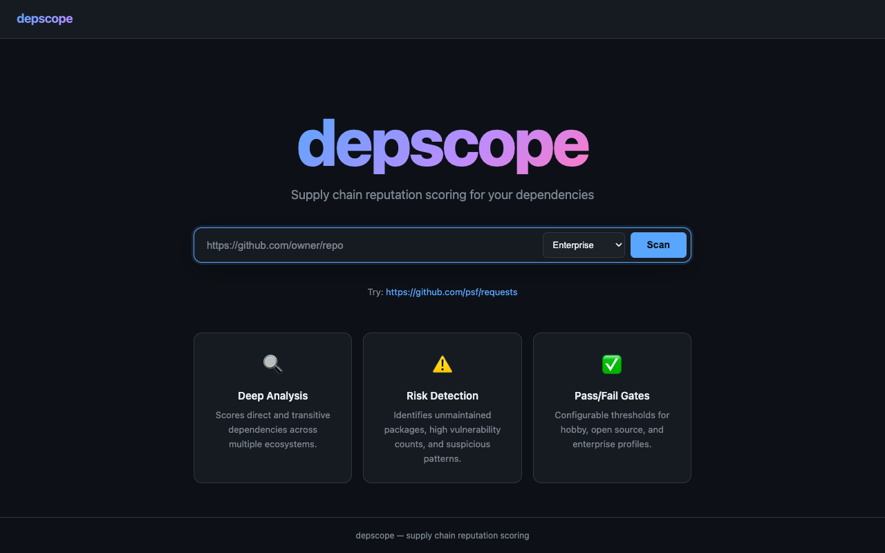

# depscope

**Find the person maintaining your entire infrastructure in Nebraska.**

[](https://xkcd.com/2347/)

Every modern software project sits on a tower of dependencies, and each of those depends on more, all the way down. Somewhere in that tree is a mass-adopted critical package maintained by one person in their spare time. [You know the one](https://xkcd.com/2347/). depscope finds it.

**depscope is not a vulnerability scanner.** CVE databases tell you what's already broken. depscope tells you what's *about to* break — by scoring the **reputation and health** of every dependency in your tree, recursively, and tracing the risk path from your code to the weakest link.

The question isn't *"does this package have a CVE?"* — it's ***"can I trust this package, and everything it pulls in, to still be maintained next year?"***



## Why Reputation, Not Just Vulnerabilities

A CVE scanner tells you `colorama` is safe today. depscope tells you:

- `colorama` hasn't been released in **3.4 years**
- It has a **single maintainer** with no org backing
- It has **no linked source repository** on PyPI
- It's pulled in by `click`, which is pulled in by `flask`, which is pulled in by **your app**
- **15 of your other dependencies** also depend on it

That's not a vulnerability. That's a **supply chain risk** — and it's the kind of thing that leads to incidents like `event-stream`, `ua-parser-js`, and `colors.js`.

## What depscope does

1. **Scans your entire dependency tree** — direct and transitive, across Go, Python, Rust, JS/TS, and PHP
2. **Scores each package on 7 reputation factors** — not just "is it broken" but "is it healthy"
3. **Propagates risk through the tree** — a risky transitive dep affects everything above it
4. **Traces risk paths** — shows you exactly which chain leads to your weakest link: `your-app → express → qs → abandoned-pkg`
5. **Detects supply chain anomalies** — new packages with suspicious download spikes, dormant projects with sudden activity, missing source repos
6. **Also scans CVEs** — because you still want to know about known vulns (via OSV.dev)

## Features

- **Multi-ecosystem support** — Go, Python, Rust, JavaScript/TypeScript, PHP/Composer
- **7-factor reputation scoring** — release recency, maintainer count, download velocity, version pinning, org backing, open issue ratio, repo health
- **Transitive risk propagation** — risk flows through the dependency tree with depth discounting
- **Risk path tracing** — shows the exact dependency chain leading to your weakest link
- **CVE scanning** — queries OSV.dev for known vulnerabilities on every package
- **Supply chain anomaly detection** — flags suspicious patterns (new+popular, dormant spike, no source repo)
- **Remote scanning** — scan GitHub/GitLab repos directly via API without cloning
- **Multiple output formats** — text table, JSON, SARIF (for GitHub Security tab)
- **Web UI** — dark-themed interactive dashboard with click-through package details
- **Configurable profiles** — hobby, open source, enterprise thresholds

## Quick Start

### CLI

```bash
# Scan a local project
depscope scan .

# Scan a remote GitHub repo
depscope scan https://github.com/pallets/flask

# Scan a GitLab repo
depscope scan https://gitlab.com/org/project

# Use a specific profile
depscope scan . --profile hobby

# JSON output for CI/CD
depscope scan . --output json

# SARIF for GitHub Security tab
depscope scan . --output sarif > results.sarif
```

### Web Server

```bash
# Start the web UI
depscope server --port 8080

# Open http://localhost:8080 in your browser
```


### Docker

```bash
# Web UI
docker run -p 8080:8080 depscope/depscope

# Web UI with GitHub token (for better scoring)
docker run -p 8080:8080 -e GITHUB_TOKEN=ghp_xxx depscope/depscope

# CLI scan with mounted project
docker run -v $(pwd):/project depscope/depscope scan /project

# CLI scan remote URL
docker run depscope/depscope scan https://github.com/psf/requests
```

## Supported Ecosystems

| Ecosystem | Manifest | Lockfile | Registry |
|-----------|----------|----------|----------|
| **Go** | `go.mod` | `go.sum` | proxy.golang.org |
| **Python** | `requirements.txt`, `pyproject.toml` | `poetry.lock`, `uv.lock` | PyPI |
| **Rust** | `Cargo.toml` | `Cargo.lock` (incl. workspaces) | crates.io |
| **JavaScript/TypeScript** | `package.json` | `package-lock.json`, `pnpm-lock.yaml`, `bun.lock` | npm |
| **PHP** | `composer.json` | `composer.lock` | Packagist |

## Reputation Scoring

This is **not** a pass/fail vulnerability check. It's a reputation assessment — like a credit score for packages. A score of 60 doesn't mean "broken", it means "you should be paying attention."

Each package is scored 0-100 based on 7 weighted factors:

| Factor | What it measures | Weight (enterprise) |
|--------|-----------------|-------------------|
| Release recency | How recently the package was released | 20% |
| Maintainer count | Number of maintainers (bus-factor risk) | 15% |
| Download velocity | Monthly download trends | 15% |
| Version pinning | How tightly the version is constrained | 15% |
| Repository health | Commit recency, archived status | 15% |
| Organization backing | Maintained by an org vs individual | 10% |
| Open issue ratio | Ratio of open to closed issues | 10% |

### Reputation Levels

| Score | Level | What it means |
|-------|-------|--------------|
| 80-100 | LOW risk | Actively maintained, multiple maintainers, org-backed. You can trust this. |
| 60-79 | MEDIUM risk | Healthy but with gaps — maybe one maintainer, or loose version pins. Monitor it. |
| 40-59 | HIGH risk | Unmaintained, solo developer, or poor pinning. Investigate alternatives. |
| 0-39 | CRITICAL risk | Abandoned, archived, or actively dangerous. The Nebraska problem lives here. |

### Profiles

| Profile | Pass Threshold | Use Case |
|---------|---------------|----------|
| Hobby | 40 | Personal projects, experiments |
| Open Source | 55 | Open source libraries |
| Enterprise | 70 | Production applications |

## CLI Output Example

### Reputation scan — finding the Nebraska problem

```
$ depscope scan /path/to/flask --profile enterprise

┌──────────────────┬────────────┬───────┬────────┬─────────────────┬────────────┐
│     PACKAGE      │  VERSION   │ SCORE │  RISK  │ TRANSITIVE RISK │ CONSTRAINT │
├──────────────────┼────────────┼───────┼────────┼─────────────────┼────────────┤
│ flask            │ 3.2.0.dev0 │ 81    │ LOW    │ HIGH            │ exact      │
│ click            │ 8.3.1      │ 81    │ LOW    │ HIGH            │ exact      │
│ colorama         │ 0.4.6      │ 47    │ HIGH   │ LOW             │ exact      │
│ types-dataclasses│ 0.6.6      │ 45    │ HIGH   │ LOW             │ exact      │
│ werkzeug         │ 3.1.6      │ 84    │ LOW    │ LOW             │ exact      │
│ jinja2           │ 3.1.6      │ 63    │ MEDIUM │ LOW             │ exact      │
│ ...              │            │       │        │                 │            │
└──────────────────┴────────────┴───────┴────────┴─────────────────┴────────────┘

Risk Paths (worst dependency chains):
  1. types-dataclasses [score: 45, HIGH]
     last release was 1362 days ago (>3 years)
  2. flask → click → colorama [score: 47, HIGH]
     last release was 1245 days ago (>3 years)
  3. pytest → colorama [score: 47, HIGH]
     last release was 1245 days ago (>3 years)
  4. tox-uv → tox-uv-bare → tox → colorama [score: 47, HIGH]
     last release was 1245 days ago (>3 years)

Result: FAIL
```

**That's the xkcd 2347 problem, made visible.** `colorama` is the person in Nebraska — one package, deep in your tree, unmaintained for 3+ years, and 10 of your dependencies rely on it. depscope doesn't just tell you `colorama` is risky — it shows you every path from your app to that risk.

### CVE scan — old packages with known vulnerabilities

```
$ depscope scan /path/to/old-project --profile enterprise

Issues:
  [CRITICAL] requests: CVE: GHSA-9wx4-h78v-vm56 — Requests Session verify bypass
  [CRITICAL] urllib3: CVE: GHSA-34jh-p97f-mpxf — Proxy-Authorization header leak
  [CRITICAL] urllib3: CVE: GHSA-v845-jxx5-vc9f — Cookie header cross-origin leak
  [HIGH] cryptography: CVE: GHSA-jfhm-5ghh-2f97 — NULL-dereference in PKCS7
  [CRITICAL] werkzeug: CVE: GHSA-2g68-c3qc-8985 — debugger remote execution
  ... (32 CVEs total across 4 packages)

Result: FAIL
```

## Web UI

The web server provides an interactive dashboard at `http://localhost:8080`:

- **Landing page** — enter a GitHub/GitLab URL, select a profile, scan
- **Results page** — score gauge, sortable package table, issue summary
- **Side panel** — click any package for detailed reputation checks, CVEs, and registry links
- **Dependency tree** — expand packages to see their transitive dependencies
- **Issue filtering** — click severity badges to filter by type

## Remote Scanning

depscope fetches only the manifest/lockfiles from remote repos — no full clone needed:

| Host | Method | Auth |
|------|--------|------|
| GitHub | Trees API + Contents API | `GITHUB_TOKEN` (optional, 60 req/hr without) |
| GitLab | Repository Tree + Files API | `GITLAB_TOKEN` (optional) |
| Other | `git clone --depth=1` | SSH key or public repo |

```bash
# Set token for higher rate limits
export GITHUB_TOKEN=ghp_your_token_here
depscope scan https://github.com/vercel/next.js
```

## Deployment

### AWS Lambda

Deploy as a Lambda Function URL with DynamoDB for scan result storage:

```bash
# Build Lambda binary
make build-lambda

# Deploy with CloudFormation
aws cloudformation deploy \
  --template-file infrastructure/template.yaml \
  --stack-name depscope \
  --capabilities CAPABILITY_IAM
```

### Docker

```dockerfile
FROM golang:1.26-alpine AS build
WORKDIR /src
COPY . .
RUN CGO_ENABLED=0 go build -o /depscope ./cmd/depscope

FROM alpine:3.19
RUN apk add --no-cache git ca-certificates
COPY --from=build /depscope /usr/local/bin/depscope
EXPOSE 8080
ENTRYPOINT ["depscope"]
CMD ["server", "--port", "8080"]
```

## CI/CD Integration

### GitHub Actions

```yaml
- name: Scan dependencies
  run: |
    depscope scan . --output sarif > depscope.sarif

- name: Upload SARIF
  uses: github/codeql-action/upload-sarif@v3
  with:
    sarif_file: depscope.sarif
```

### Exit Codes

| Code | Meaning |
|------|---------|
| 0 | All packages pass the threshold |
| 1 | One or more packages below threshold |

## Configuration

Create `depscope.yaml` in your project root:

```yaml
profile: enterprise
pass_threshold: 75
depth: 10

registries:
  github_token: ${GITHUB_TOKEN}

vuln_sources:
  osv: true
  nvd: true
  nvd_api_key: ${NVD_KEY}

# Override individual factor weights (must sum to 100)
# weights:
#   release_recency: 25
#   maintainer_count: 20
```

```bash
depscope scan . --config depscope.yaml
```

## How depscope is different

| Tool | Focus | Limitation |
|------|-------|-----------|
| **Snyk, Dependabot** | Known CVEs | Only finds *already discovered* vulnerabilities |
| **npm audit** | Known CVEs | Single ecosystem, no transitive reputation |
| **Socket.dev** | Install scripts, typosquatting | Closed source, npm-only |
| **depscope** | **Reputation of the entire tree** | Complements CVE scanners — finds risk *before* it becomes a CVE |

CVE scanners answer: *"Is this package broken right now?"*

depscope answers: *"Is this package likely to become a problem?"*

Both matter. Use them together.

## Architecture

```
depscope/
├── cmd/depscope/        # CLI entrypoint (scan, server, package, cache)
├── cmd/lambda/          # AWS Lambda adapter
├── internal/
│   ├── scanner/         # Shared scan pipeline
│   ├── manifest/        # Parsers: Go, Python, Rust, JS, PHP
│   ├── registry/        # Clients: PyPI, npm, crates.io, Go proxy, Packagist
│   ├── resolve/         # Remote repo resolvers: GitHub, GitLab, git clone
│   ├── vcs/             # GitHub repo health client
│   ├── vuln/            # OSV.dev + NVD vulnerability clients
│   ├── core/            # Scoring engine, propagator, risk paths, suspicious detection
│   ├── config/          # Profiles, weight system, YAML config
│   ├── cache/           # Disk-backed TTL cache
│   ├── report/          # Text, JSON, SARIF formatters
│   ├── server/          # HTTP server + handlers + scan store
│   └── web/             # Embedded HTML templates + CSS + JS
├── infrastructure/      # CloudFormation template
├── Dockerfile
└── Makefile
```

## Development

```bash
# Build
make build

# Test
make test

# Build Lambda deployment package
make build-lambda

# Run web server
./bin/depscope server --port 8080
```

## License

MIT
