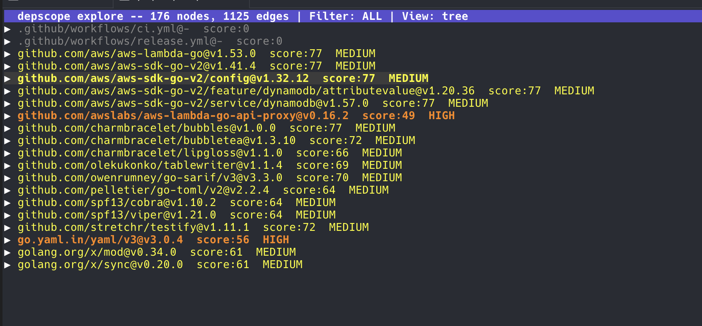
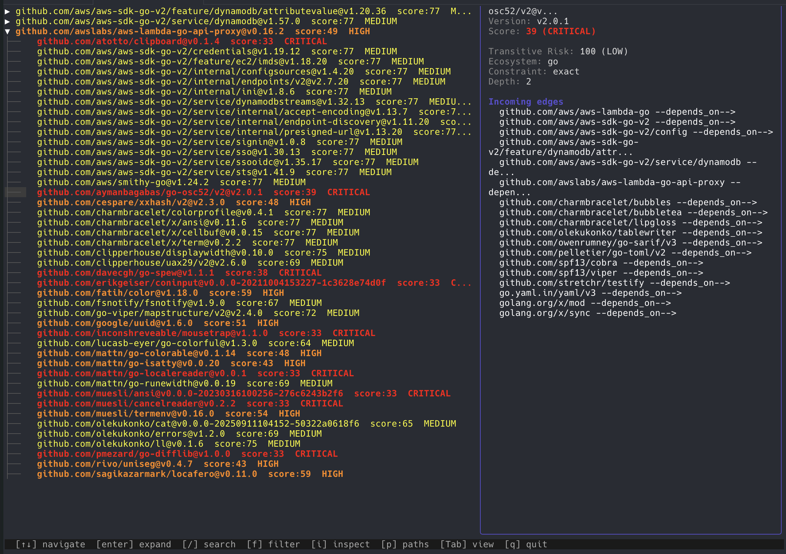
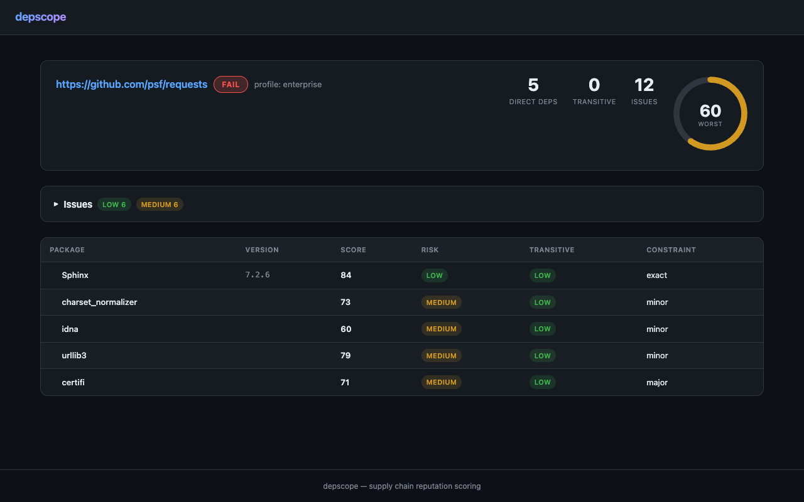

# depscope

**Find the person maintaining your entire infrastructure in Nebraska.**

[](https://xkcd.com/2347/)

Every modern software project sits on a tower of dependencies, and each of those depends on more, all the way down. Somewhere in that tree is a mass-adopted critical package maintained by one person in their spare time. [You know the one](https://xkcd.com/2347/). depscope finds it.

**depscope is not a vulnerability scanner.** CVE databases tell you what's already broken. depscope tells you what's *about to* break — by scoring the **reputation and health** of every dependency in your tree, recursively, and tracing the risk path from your code to the weakest link.

The question isn't *"does this package have a CVE?"* — it's ***"can I trust this package, and everything it pulls in, to still be maintained next year?"***


## Why Reputation, Not Just Vulnerabilities

A CVE scanner tells you `colorama` is safe today. depscope tells you:

- `colorama` hasn't been released in **3.4 years**
- It has a **single maintainer** with no org backing
- It has **no linked source repository** on PyPI
- It's pulled in by `click`, which is pulled in by `flask`, which is pulled in by **your app**
- **15 of your other dependencies** also depend on it

That's not a vulnerability. That's a **supply chain risk** — and it's the kind of thing that leads to incidents like `event-stream`, `ua-parser-js`, and `colors.js`.

## What depscope does

1. **Scans your entire dependency tree** — direct and transitive, across Go, Python, Rust, JS/TS, and PHP
2. **Scores each package on 7 reputation factors** — not just "is it broken" but "is it healthy"
3. **Propagates risk through the tree** — a risky transitive dep affects everything above it
4. **Traces risk paths** — shows you exactly which chain leads to your weakest link: `your-app → express → qs → abandoned-pkg`
5. **Detects supply chain anomalies** — new packages with suspicious download spikes, dormant projects with sudden activity, missing source repos
6. **Also scans CVEs** — because you still want to know about known vulns (via OSV.dev)

## Features

- **Multi-ecosystem support** — Go, Python, Rust, JavaScript/TypeScript, PHP/Composer
- **7-factor reputation scoring** — release recency, maintainer count, download velocity, version pinning, org backing, open issue ratio, repo health
- **Transitive risk propagation** — risk flows through the dependency tree with depth discounting
- **Risk path tracing** — shows the exact dependency chain leading to your weakest link
- **CVE scanning** — queries OSV.dev for known vulnerabilities on every package
- **Supply chain anomaly detection** — flags suspicious patterns (new+popular, dormant spike, no source repo)
- **Full-machine supply chain index** — index every dependency on your machine with incremental re-indexing, global dedup, and full transitive dependency trees from lockfiles (npm, Cargo, Poetry, Composer)
- **Compromised package scanner** — check for known-bad packages with semver range matching, dependency chain tracing, and instant queries from the index
- **Risk enrichment** — add reputation scores and CVE data to every indexed package via registry + VCS + OSV lookups, resumable and cacheable
- **Risk reporting** — comprehensive CLI reports with risk distribution charts, CVE summaries, ecosystem breakdowns, and most-exposed manifests, filterable by ecosystem
- **Remote scanning** — scan GitHub/GitLab repos directly via API without cloning
- **GitHub Actions scanning** — 5-layer deep analysis of CI/CD workflows: pinning quality, bundled code, transitive action deps
- **Docker image scanning** — detects unpinned base images and scores official vs third-party images
- **Script download detection** — flags curl|bash patterns in CI pipelines as CRITICAL risk
- **Supply chain graph** — models the full dependency graph (packages, repos, actions, Docker images) with 11 node types and 13 edge types
- **Interactive TUI explorer** — navigate the supply chain graph with tree/flat views, search, filter, inspect, and path tracing
- **Interactive index browser** — TUI for searching indexed packages with live filtering, dependency chain display, and score/risk coloring
- **Incident response discovery** — find every project affected by a compromised package across your entire filesystem
- **Org-wide scanning** — scan all repos in a GitHub organization in one command
- **Multiple output formats** — text table, JSON, SARIF (for GitHub Security tab)
- **Web UI** — dark-themed interactive dashboard with scan results, D3 graph visualization, and index search with risk dashboard
- **Configurable profiles** — hobby, open source, enterprise thresholds

## Supply Chain Index: `index`

Index every dependency on your machine — across all ecosystems, including `node_modules`, hidden directories, and installed packages. Build a searchable SQLite database for instant queries.

```bash
# Index your entire home directory (incremental — seconds on re-runs)
depscope index ~

# Full rescan
depscope index ~ --force

# Check what's indexed
depscope index status
depscope index list --ecosystem npm
depscope index search axios

# Interactive TUI browser
depscope index explore
```

### What gets indexed

| Ecosystem | Primary Manifest | Companion Lockfile (auto-loaded) | Dep Tree Extracted |
|-----------|-----------------|----------------------------------|-------------------|
| npm | `package.json` | `package-lock.json`, `pnpm-lock.yaml` | Full transitive |
| Go | `go.mod` | — | Direct only |
| Python | `pyproject.toml`, `requirements.txt` | `poetry.lock`, `uv.lock` | Full transitive (Poetry) |
| Rust | `Cargo.toml` | `Cargo.lock` | Full transitive |
| PHP | `composer.json` | `composer.lock` | Full transitive |
| npm (installed) | `node_modules/*/package.json` | — | Installed version |

### Incremental indexing

The indexer tracks file mtimes. On re-runs, only changed manifests are re-parsed — making repeated indexing near-instant even on large trees.

### Global dedup

Each unique `package@version` is stored once. If `axios@1.14.1` appears in 50 projects, there's one package row and 50 manifest links. This makes statistics and cross-project queries efficient.

## Compromised Package Scanner: `compromised`

Check for known-bad packages across your dependency tree — by walking the filesystem or querying the pre-built index.

```bash
# Walk a directory (npm manifests + lockfiles)
depscope compromised /src --packages "axios@1.14.1,axios@0.30.4"

# Instant query from the index (all ecosystems)
depscope compromised --from-index --packages "axios@1.14.1"

# Use a file with semver ranges
depscope compromised --from-index --file compromised.txt

# Search by name only (find all versions)
depscope compromised --from-index --packages "axios"
```

### Supported matching

- Exact: `axios@1.14.1`
- Name only: `axios` (matches all versions)
- Caret: `axios@^1.14.0`
- Tilde: `axios@~1.14.0`
- Range: `event-stream@>=3.3.4,<3.3.7`
- Compound operators: `>=`, `>`, `<=`, `<`, `*`

### Output with dependency chain tracing

```
DIRECT    webapp/package.json       axios@1.14.1  (constraint: ^1.14.0)
INDIRECT  api/package.json          axios@0.30.4  (path: __root__ -> @mylib/http -> axios)
DIRECT    .tools/cli/package.json   axios@1.14.1  (constraint: ^1.14.0)
```

Results are classified as DIRECT (in package.json) or INDIRECT (transitive), with full dependency path tracing when using `--from-index`.

## Incident Response: `discover`

When a package gets compromised or a CVE drops, you need to know which of your projects are affected — fast. The `discover` command searches across your entire filesystem (or a list of repos) and classifies every project's exposure.

```bash
# "litellm got compromised — where are we exposed?"
depscope discover litellm --range ">=1.82.7,<1.83.0" ~/repos

# Check a curated list of projects
depscope discover litellm --range ">=1.82.7,<1.83.0" --list projects.txt

# Air-gapped environment (no registry calls)
depscope discover litellm --range ">=1.82.7,<1.83.0" --offline ~/repos

# JSON for piping into dashboards
depscope discover litellm --range ">=1.82.7,<1.83.0" --output json ~/repos
```

### How it works

**Two-phase pipeline** for speed:

1. **Fast scan** — walks the filesystem, opens every manifest/lockfile, and does a text search for the package name. 95% of projects are eliminated in milliseconds.
2. **Precise classification** — for matches, parses the actual version constraints and lockfile entries to classify exposure.

### Classification buckets

Every project is placed in one of four buckets:

| Status | Meaning |
|--------|---------|
| **Confirmed** | Lockfile pins a version inside the compromised range |
| **Potentially affected** | Manifest constraint *allows* compromised versions, but no lockfile to confirm |
| **Unresolvable** | Cannot determine (unpinned, no lockfile, offline mode) |
| **Safe** | Package found but version is outside the compromised range |

### Example output

```
$ depscope discover litellm --range ">=1.82.7" --offline ~/

🔴 CONFIRMED AFFECTED (1 project)
  /home/me/repos/api-service
    Source: uv.lock
    Installed: litellm 1.82.8
    Depth: transitive (via langchain → litellm)

🟡 POTENTIALLY AFFECTED (3 projects)
  /home/me/repos/ml-pipeline
    Source: pyproject.toml
    Constraint: litellm >=1.80
    Reason: constraint allows compromised versions

🟢 SAFE (2 projects)
  /home/me/repos/chatbot
    Source: uv.lock
    Installed: litellm 1.81.0

Summary: 1 confirmed, 3 potentially, 0 unresolvable, 2 safe (6 total)
```

### Operating modes

| Mode | Network | Transitive coverage | Use case |
|------|---------|-------------------|----------|
| **Default** | Yes (for projects without lockfiles) | Full: lockfile tree + registry resolution | Standard incident response |
| **`--resolve`** | Yes (extended) | Full + checks current installable version | Higher confidence on "potentially affected" |
| **`--offline`** | None | Lockfile-only (warns about limitations) | Air-gapped environments |

### Transitive dependency detection

Lockfiles (uv.lock, poetry.lock, package-lock.json, etc.) contain the full resolved dependency tree — so `discover` finds transitive exposure automatically. If a project has no lockfile, the default mode resolves the tree via registry APIs (PyPI, npm) to check for hidden transitive exposure.

## CI/CD Supply Chain: `scan --only actions`

Your CI pipeline is part of your supply chain. A compromised GitHub Action has the same impact as a compromised package — it runs code in your build environment with access to your secrets.

```bash
# Scan GitHub Actions in your project
depscope scan . --only actions

# Scan all repos in your org
depscope scan --org my-org --only actions

# Full scan: packages + actions + Docker
depscope scan .
```

### What it checks

depscope resolves GitHub Actions through **5 layers**:

1. **Workflow parsing** — extracts all `uses:` references, `run:` blocks, container images
2. **Ref resolution** — resolves tags to immutable SHAs via GitHub API
3. **action.yml analysis** — determines action type (composite, JavaScript, Docker)
4. **Bundled code** — scans `package.json` inside JS actions, `Dockerfile` inside Docker actions
5. **Reusable workflows** — follows `uses: org/repo/.github/workflows/x.yml@ref` references recursively

### Pinning analysis

```
Pinning Summary (GitHub Actions):
  SHA-pinned:      0 (0%)
  Exact version:   0 (0%)
  Major tag:       4 (80%)  ⚠
  Branch:          1 (20%)  ⚠⚠

  First-party:    2    Third-party: 3
  Script downloads: 0
```

Actions from `actions/*` and `github/*` (first-party) get reduced pinning penalty. Third-party actions pinned to branches are flagged as high risk.

### Hidden dependencies

A typical GitHub Action bundles 20-30 npm packages that are invisible to standard dependency scanners. depscope exposes them:

```
actions/checkout          bundles 21 npm packages
actions/setup-go          bundles 24 npm packages
golangci/golangci-lint    bundles 23 npm packages
goreleaser-action         bundles 22 npm packages
```

These are real dependencies in your build pipeline — and nobody audits them.

## Interactive Explorer: `explore`

Navigate your full supply chain graph interactively in the terminal.

```bash
depscope explore .                    # scan + launch TUI
depscope explore . --only actions     # actions only
depscope explore . --no-cve           # skip CVE scanning
```



### Tree View (default)

Expandable dependency tree showing packages, actions, Docker images, and their relationships. Nodes are color-coded by risk: red (CRITICAL), orange (HIGH), yellow (MEDIUM), green (LOW).

```
▼ .github/workflows/ci.yml
  ├── actions/checkout@v4          [MEDIUM] score=61  pin=major_tag ⚠
  │   ├── @actions/core@1.10.0     [CRITICAL] score=0  (bundled)
  │   └── @actions/github@5.1.1    [CRITICAL] score=0  (bundled)
  ├── actions/setup-go@v5          [MEDIUM] score=61  pin=major_tag ⚠
  └── golangci/lint-action@v7      [HIGH]   score=52  pin=major_tag ⚠
▼ github.com/spf13/cobra@v1.10.2   [MEDIUM] score=64
  └── gopkg.in/yaml.v3@v3.0.1      [CRITICAL] score=35
```

### Flat View (Tab)

All nodes sorted by score — worst first. Quickly find your weakest links.

### Keyboard shortcuts

| Key | Action |
|-----|--------|
| `↑↓` / `jk` | Navigate |
| `Enter` | Expand node (if children) or inspect (if leaf) |
| `Tab` | Switch between tree and flat view |
| `/` | Fuzzy search across all nodes |
| `f` | Filter: All → HIGH+ → CRITICAL only |
| `i` | Inspect panel with full node details |
| `p` | Show all paths from root to selected node |
| `Esc` | Close panel / cancel search |
| `q` | Quit |



### Inspect Panel

Press `Enter` on a leaf node or `i` on any node to see full details:

- Score breakdown with risk-colored output
- Transitive risk score
- Ecosystem, version, constraint type
- First-party status (for actions)
- All incoming and outgoing edges
- Pinning quality and resolved SHA

## Quick Start

### CLI

```bash
# Scan a local project (packages + actions + Docker)
depscope scan .

# Scan a remote GitHub repo
depscope scan https://github.com/pallets/flask

# Interactive graph explorer
depscope explore .

# Index your entire machine
depscope index ~
depscope index status
depscope index explore                    # interactive TUI browser

# Check for compromised packages (instant from index)
depscope compromised --from-index --packages "axios@1.14.1,axios@0.30.4"
depscope compromised --from-index --file known-bad.txt

# Find projects affected by a compromised package
depscope discover litellm --range ">=1.82.7,<1.83.0" ~/repos

# Search the index
depscope index search axios              # where is axios used?
depscope index list --ecosystem npm       # all npm manifests

# JSON output for CI/CD
depscope scan . --output json

# SARIF for GitHub Security tab
depscope scan . --output sarif > results.sarif
```

### Web Server

```bash
# Start the web UI
depscope server --port 8080

# Open http://localhost:8080 in your browser
```


### Docker

```bash
# Web UI
docker run -p 8080:8080 depscope/depscope

# Web UI with GitHub token (for better scoring)
docker run -p 8080:8080 -e GITHUB_TOKEN=ghp_xxx depscope/depscope

# CLI scan with mounted project
docker run -v $(pwd):/project depscope/depscope scan /project

# CLI scan remote URL
docker run depscope/depscope scan https://github.com/psf/requests
```

## Supported Ecosystems

| Ecosystem | Manifest | Lockfile | Registry |
|-----------|----------|----------|----------|
| **Go** | `go.mod` | `go.sum` | proxy.golang.org |
| **Python** | `requirements.txt`, `pyproject.toml` | `poetry.lock`, `uv.lock` | PyPI |
| **Rust** | `Cargo.toml` | `Cargo.lock` (incl. workspaces) | crates.io |
| **JavaScript/TypeScript** | `package.json` | `package-lock.json`, `pnpm-lock.yaml`, `bun.lock` | npm |
| **PHP** | `composer.json` | `composer.lock` | Packagist |

## Reputation Scoring

This is **not** a pass/fail vulnerability check. It's a reputation assessment — like a credit score for packages. A score of 60 doesn't mean "broken", it means "you should be paying attention."

Each package is scored 0-100 based on 7 weighted factors:

| Factor | What it measures | Weight (enterprise) |
|--------|-----------------|-------------------|
| Release recency | How recently the package was released | 20% |
| Maintainer count | Number of maintainers (bus-factor risk) | 15% |
| Download velocity | Monthly download trends | 15% |
| Version pinning | How tightly the version is constrained | 15% |
| Repository health | Commit recency, archived status | 15% |
| Organization backing | Maintained by an org vs individual | 10% |
| Open issue ratio | Ratio of open to closed issues | 10% |

### Reputation Levels

| Score | Level | What it means |
|-------|-------|--------------|
| 80-100 | LOW risk | Actively maintained, multiple maintainers, org-backed. You can trust this. |
| 60-79 | MEDIUM risk | Healthy but with gaps — maybe one maintainer, or loose version pins. Monitor it. |
| 40-59 | HIGH risk | Unmaintained, solo developer, or poor pinning. Investigate alternatives. |
| 0-39 | CRITICAL risk | Abandoned, archived, or actively dangerous. The Nebraska problem lives here. |

### Profiles

| Profile | Pass Threshold | Use Case |
|---------|---------------|----------|
| Hobby | 40 | Personal projects, experiments |
| Open Source | 55 | Open source libraries |
| Enterprise | 70 | Production applications |

## CLI Output Example

### Reputation scan — finding the Nebraska problem

```
$ depscope scan /path/to/flask --profile enterprise

┌──────────────────┬────────────┬───────┬────────┬─────────────────┬────────────┐
│     PACKAGE      │  VERSION   │ SCORE │  RISK  │ TRANSITIVE RISK │ CONSTRAINT │
├──────────────────┼────────────┼───────┼────────┼─────────────────┼────────────┤
│ flask            │ 3.2.0.dev0 │ 81    │ LOW    │ HIGH            │ exact      │
│ click            │ 8.3.1      │ 81    │ LOW    │ HIGH            │ exact      │
│ colorama         │ 0.4.6      │ 47    │ HIGH   │ LOW             │ exact      │
│ types-dataclasses│ 0.6.6      │ 45    │ HIGH   │ LOW             │ exact      │
│ werkzeug         │ 3.1.6      │ 84    │ LOW    │ LOW             │ exact      │
│ jinja2           │ 3.1.6      │ 63    │ MEDIUM │ LOW             │ exact      │
│ ...              │            │       │        │                 │            │
└──────────────────┴────────────┴───────┴────────┴─────────────────┴────────────┘

Risk Paths (worst dependency chains):
  1. types-dataclasses [score: 45, HIGH]
     last release was 1362 days ago (>3 years)
  2. flask → click → colorama [score: 47, HIGH]
     last release was 1245 days ago (>3 years)
  3. pytest → colorama [score: 47, HIGH]
     last release was 1245 days ago (>3 years)
  4. tox-uv → tox-uv-bare → tox → colorama [score: 47, HIGH]
     last release was 1245 days ago (>3 years)

Result: FAIL
```

**That's the xkcd 2347 problem, made visible.** `colorama` is the person in Nebraska — one package, deep in your tree, unmaintained for 3+ years, and 10 of your dependencies rely on it. depscope doesn't just tell you `colorama` is risky — it shows you every path from your app to that risk.

### CVE scan — old packages with known vulnerabilities

```
$ depscope scan /path/to/old-project --profile enterprise

Issues:
  [CRITICAL] requests: CVE: GHSA-9wx4-h78v-vm56 — Requests Session verify bypass
  [CRITICAL] urllib3: CVE: GHSA-34jh-p97f-mpxf — Proxy-Authorization header leak
  [CRITICAL] urllib3: CVE: GHSA-v845-jxx5-vc9f — Cookie header cross-origin leak
  [HIGH] cryptography: CVE: GHSA-jfhm-5ghh-2f97 — NULL-dereference in PKCS7
  [CRITICAL] werkzeug: CVE: GHSA-2g68-c3qc-8985 — debugger remote execution
  ... (32 CVEs total across 4 packages)

Result: FAIL
```

## Web UI

The web server provides an interactive dashboard at `http://localhost:8080`:

```bash
depscope server --cache-db ~/.cache/depscope/depscope-cache.db --port 8080
```



- **Landing page** (`/`) — enter a GitHub/GitLab URL, select a profile, scan
- **Results page** (`/scan/{id}`) — score gauge, sortable package table, issue summary with severity filtering
- **Graph visualization** (`/scan/{id}/graph`) — D3 force-directed supply chain graph with filters, blast radius analysis, zero-day simulation
- **Index browser** (`/search`) — search the dependency index, check compromised packages, see ecosystem stats and top packages
- **Side panel** — click any package for detailed reputation checks, CVEs, and registry links
- **Dependency tree** — expand packages to see their transitive dependencies recursively

## Remote Scanning

depscope fetches only the manifest/lockfiles from remote repos — no full clone needed:

| Host | Method | Auth |
|------|--------|------|
| GitHub | Trees API + Contents API | `GITHUB_TOKEN` (optional, 60 req/hr without) |
| GitLab | Repository Tree + Files API | `GITLAB_TOKEN` (optional) |
| Other | `git clone --depth=1` | SSH key or public repo |

```bash
# Set token for higher rate limits
export GITHUB_TOKEN=ghp_your_token_here
depscope scan https://github.com/vercel/next.js
```

## Deployment

### AWS Lambda

Deploy as a Lambda Function URL with DynamoDB for scan result storage:

```bash
# Build Lambda binary
make build-lambda

# Deploy with CloudFormation
aws cloudformation deploy \
  --template-file infrastructure/template.yaml \
  --stack-name depscope \
  --capabilities CAPABILITY_IAM
```

### Docker

```dockerfile
FROM golang:1.26-alpine AS build
WORKDIR /src
COPY . .
RUN CGO_ENABLED=0 go build -o /depscope ./cmd/depscope

FROM alpine:3.19
RUN apk add --no-cache git ca-certificates
COPY --from=build /depscope /usr/local/bin/depscope
EXPOSE 8080
ENTRYPOINT ["depscope"]
CMD ["server", "--port", "8080"]
```

## CI/CD Integration

### GitHub Actions

```yaml
- name: Scan dependencies
  run: |
    depscope scan . --output sarif > depscope.sarif

- name: Upload SARIF
  uses: github/codeql-action/upload-sarif@v3
  with:
    sarif_file: depscope.sarif
```

### Exit Codes

| Command | Code 0 | Code 1 |
|---------|--------|--------|
| `scan` | All packages pass the threshold | One or more packages below threshold |
| `discover` | No confirmed or potentially affected projects | Confirmed or potentially affected projects found |

## Configuration

Create `depscope.yaml` in your project root:

```yaml
profile: enterprise
pass_threshold: 75
depth: 10

registries:
  github_token: ${GITHUB_TOKEN}

vuln_sources:
  osv: true
  nvd: true
  nvd_api_key: ${NVD_KEY}

# Override individual factor weights (must sum to 100)
# weights:
#   release_recency: 25
#   maintainer_count: 20
```

```bash
depscope scan . --config depscope.yaml
```

## How depscope is different

| Tool | Focus | Limitation |
|------|-------|-----------|
| **Snyk, Dependabot** | Known CVEs | Only finds *already discovered* vulnerabilities |
| **npm audit** | Known CVEs | Single ecosystem, no transitive reputation |
| **Socket.dev** | Install scripts, typosquatting | Closed source, npm-only |
| **depscope** | **Reputation of the entire tree** | Complements CVE scanners — finds risk *before* it becomes a CVE |

CVE scanners answer: *"Is this package broken right now?"*

depscope answers: *"Is this package likely to become a problem?"*

Both matter. Use them together.

## Architecture

```
depscope/
├── cmd/depscope/        # CLI: scan, discover, explore, index, compromised, server, cache
├── cmd/lambda/          # AWS Lambda adapter
├── internal/
│   ├── scanner/         # Scan pipeline, indexer, compromised checker, semver matching
│   ├── crawler/         # BFS dependency crawler with 8 resolvers
│   ├── graph/           # Supply chain graph: nodes, edges, propagation
│   ├── actions/         # GitHub Actions: 5-layer scanner, scoring, pinning
│   ├── manifest/        # Parsers: Go, Python, Rust, JS, PHP
│   ├── discover/        # Incident response: find affected projects
│   ├── tui/             # Interactive terminal explorer + index search (bubbletea)
│   ├── registry/        # Clients: PyPI, npm, crates.io, Go proxy, Packagist
│   ├── resolve/         # Remote repo resolvers: GitHub, GitLab, git clone
│   ├── vcs/             # GitHub repo health client
│   ├── vuln/            # OSV.dev + NVD vulnerability clients
│   ├── core/            # Scoring engine, risk paths, anomaly detection, org trust
│   ├── config/          # Profiles, weight system, YAML config
│   ├── cache/           # SQLite cache: projects, versions, deps, index, findings
│   ├── report/          # Text, JSON, SARIF, ASCII tree + pinning summary
│   ├── server/          # HTTP server + handlers + index API + scan store
│   └── web/             # Embedded HTML templates + CSS + JS (graph, search)
├── infrastructure/      # CloudFormation template
├── Dockerfile
└── Makefile
```

### SQLite Schema (10 tables)

| Table | Purpose |
|-------|---------|
| `projects` | Unique packages across all ecosystems |
| `project_versions` | Unique package@version entries |
| `version_dependencies` | Dependency edges (parent→child) from lockfiles |
| `index_manifests` | Every discovered manifest file on disk |
| `manifest_packages` | Junction: which manifests contain which packages |
| `index_runs` | Indexing run history and statistics |
| `compromised_findings` | Results from compromised package scans |
| `ref_resolutions` | Git ref→SHA resolution cache |
| `cve_cache` | CVE/vulnerability findings cache |

## Development

```bash
# Build
make build

# Test
make test

# Build Lambda deployment package
make build-lambda

# Run web server
./bin/depscope server --port 8080
```

## License

MIT
