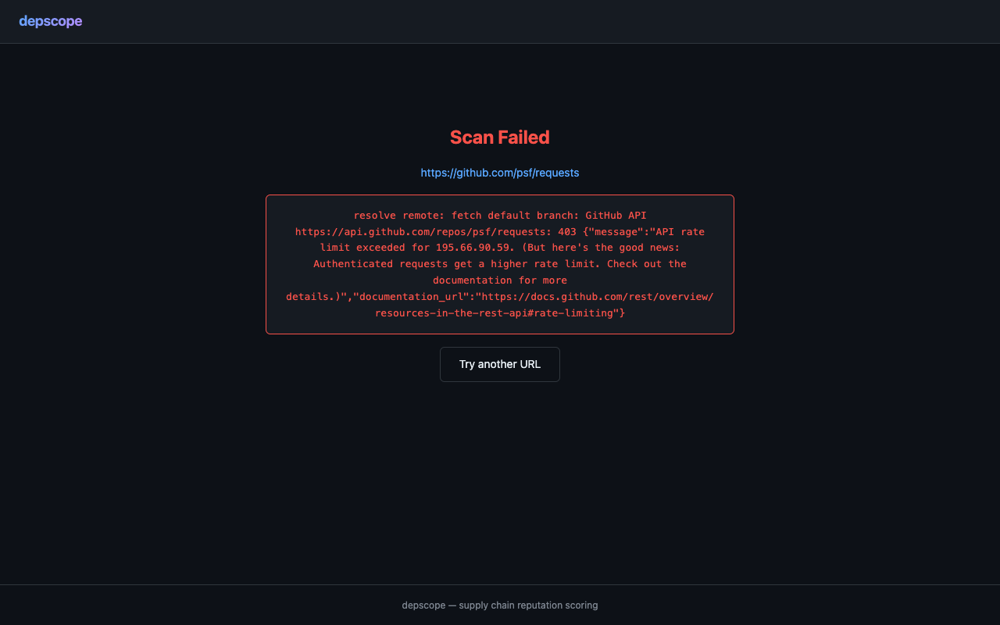

# depscope

**Supply chain reputation scoring for your dependencies.**

depscope scans your project's dependency tree and scores each package for supply chain reputation risk. It goes beyond CVE scanning — it evaluates maintainer health, release activity, version pinning, organizational backing, and repository health to answer one question: **can you trust this dependency and everything it pulls in?**


## Features

- **Multi-ecosystem support** — Go, Python, Rust, JavaScript/TypeScript, PHP/Composer
- **7-factor reputation scoring** — release recency, maintainer count, download velocity, version pinning, org backing, open issue ratio, repo health
- **Transitive risk propagation** — risk flows through the dependency tree with depth discounting
- **Risk path tracing** — shows the exact dependency chain leading to your weakest link
- **CVE scanning** — queries OSV.dev for known vulnerabilities on every package
- **Supply chain anomaly detection** — flags suspicious patterns (new+popular, dormant spike, no source repo)
- **Remote scanning** — scan GitHub/GitLab repos directly via API without cloning
- **Multiple output formats** — text table, JSON, SARIF (for GitHub Security tab)
- **Web UI** — dark-themed interactive dashboard with click-through package details
- **Configurable profiles** — hobby, open source, enterprise thresholds

## Quick Start

### CLI

```bash
# Scan a local project
depscope scan .

# Scan a remote GitHub repo
depscope scan https://github.com/pallets/flask

# Scan a GitLab repo
depscope scan https://gitlab.com/org/project

# Use a specific profile
depscope scan . --profile hobby

# JSON output for CI/CD
depscope scan . --output json

# SARIF for GitHub Security tab
depscope scan . --output sarif > results.sarif
```

### Web Server

```bash
# Start the web UI
depscope server --port 8080

# Open http://localhost:8080 in your browser
```



### Docker

```bash
# Web UI
docker run -p 8080:8080 depscope/depscope

# Web UI with GitHub token (for better scoring)
docker run -p 8080:8080 -e GITHUB_TOKEN=ghp_xxx depscope/depscope

# CLI scan with mounted project
docker run -v $(pwd):/project depscope/depscope scan /project

# CLI scan remote URL
docker run depscope/depscope scan https://github.com/psf/requests
```

## Supported Ecosystems

| Ecosystem | Manifest | Lockfile | Registry |
|-----------|----------|----------|----------|
| **Go** | `go.mod` | `go.sum` | proxy.golang.org |
| **Python** | `requirements.txt`, `pyproject.toml` | `poetry.lock`, `uv.lock` | PyPI |
| **Rust** | `Cargo.toml` | `Cargo.lock` (incl. workspaces) | crates.io |
| **JavaScript/TypeScript** | `package.json` | `package-lock.json`, `pnpm-lock.yaml`, `bun.lock` | npm |
| **PHP** | `composer.json` | `composer.lock` | Packagist |

## Scoring

Each package is scored 0-100 based on 7 weighted factors:

| Factor | What it measures | Weight (enterprise) |
|--------|-----------------|-------------------|
| Release recency | How recently the package was released | 20% |
| Maintainer count | Number of maintainers (bus-factor risk) | 15% |
| Download velocity | Monthly download trends | 15% |
| Version pinning | How tightly the version is constrained | 15% |
| Repository health | Commit recency, archived status | 15% |
| Organization backing | Maintained by an org vs individual | 10% |
| Open issue ratio | Ratio of open to closed issues | 10% |

### Risk Levels

| Score | Risk | Meaning |
|-------|------|---------|
| 80-100 | LOW | Well-maintained, trustworthy |
| 60-79 | MEDIUM | Some concerns, monitor |
| 40-59 | HIGH | Significant risk, investigate |
| 0-39 | CRITICAL | Unacceptable risk, action required |

### Profiles

| Profile | Pass Threshold | Use Case |
|---------|---------------|----------|
| Hobby | 40 | Personal projects, experiments |
| Open Source | 55 | Open source libraries |
| Enterprise | 70 | Production applications |

## CLI Output Example

```
depscope scan /tmp/vuln-test --profile enterprise

┌──────────────┬─────────┬───────┬────────┬─────────────────┬────────────┐
│   PACKAGE    │ VERSION │ SCORE │  RISK  │ TRANSITIVE RISK │ CONSTRAINT │
├──────────────┼─────────┼───────┼────────┼─────────────────┼────────────┤
│ requests     │ 2.28.0  │ 68    │ MEDIUM │ LOW             │ exact      │
│ urllib3      │ 1.26.5  │ 77    │ MEDIUM │ LOW             │ exact      │
│ cryptography │ 38.0.0  │ 71    │ MEDIUM │ LOW             │ exact      │
│ werkzeug     │ 2.3.0   │ 71    │ MEDIUM │ LOW             │ exact      │
└──────────────┴─────────┴───────┴────────┴─────────────────┴────────────┘

Risk Paths (worst dependency chains):
  1. requests [score: 68, MEDIUM]
     CVE: GHSA-9hjg-9r4m-mvj7 — Requests vulnerable to .netrc credentials leak

Issues:
  [CRITICAL] requests: CVE: GHSA-9wx4-h78v-vm56 — Requests Session verify bypass
  [CRITICAL] urllib3: CVE: GHSA-34jh-p97f-mpxf — Proxy-Authorization header leak
  [CRITICAL] urllib3: CVE: GHSA-g4mx-q9vg-27p4 — Request body not stripped
  [CRITICAL] urllib3: CVE: GHSA-v845-jxx5-vc9f — Cookie header cross-origin leak
  [HIGH] cryptography: CVE: GHSA-jfhm-5ghh-2f97 — NULL-dereference in PKCS7
  ...

Result: FAIL
```

## Web UI

The web server provides an interactive dashboard at `http://localhost:8080`:

- **Landing page** — enter a GitHub/GitLab URL, select a profile, scan
- **Results page** — score gauge, sortable package table, issue summary
- **Side panel** — click any package for detailed reputation checks, CVEs, and registry links
- **Dependency tree** — expand packages to see their transitive dependencies
- **Issue filtering** — click severity badges to filter by type

## Remote Scanning

depscope fetches only the manifest/lockfiles from remote repos — no full clone needed:

| Host | Method | Auth |
|------|--------|------|
| GitHub | Trees API + Contents API | `GITHUB_TOKEN` (optional, 60 req/hr without) |
| GitLab | Repository Tree + Files API | `GITLAB_TOKEN` (optional) |
| Other | `git clone --depth=1` | SSH key or public repo |

```bash
# Set token for higher rate limits
export GITHUB_TOKEN=ghp_your_token_here
depscope scan https://github.com/vercel/next.js
```

## Deployment

### AWS Lambda

Deploy as a Lambda Function URL with DynamoDB for scan result storage:

```bash
# Build Lambda binary
make build-lambda

# Deploy with CloudFormation
aws cloudformation deploy \
  --template-file infrastructure/template.yaml \
  --stack-name depscope \
  --capabilities CAPABILITY_IAM
```

### Docker

```dockerfile
FROM golang:1.26-alpine AS build
WORKDIR /src
COPY . .
RUN CGO_ENABLED=0 go build -o /depscope ./cmd/depscope

FROM alpine:3.19
RUN apk add --no-cache git ca-certificates
COPY --from=build /depscope /usr/local/bin/depscope
EXPOSE 8080
ENTRYPOINT ["depscope"]
CMD ["server", "--port", "8080"]
```

## CI/CD Integration

### GitHub Actions

```yaml
- name: Scan dependencies
  run: |
    depscope scan . --output sarif > depscope.sarif

- name: Upload SARIF
  uses: github/codeql-action/upload-sarif@v3
  with:
    sarif_file: depscope.sarif
```

### Exit Codes

| Code | Meaning |
|------|---------|
| 0 | All packages pass the threshold |
| 1 | One or more packages below threshold |

## Configuration

Create `depscope.yaml` in your project root:

```yaml
profile: enterprise
pass_threshold: 75
depth: 10

registries:
  github_token: ${GITHUB_TOKEN}

vuln_sources:
  osv: true
  nvd: true
  nvd_api_key: ${NVD_KEY}

# Override individual factor weights (must sum to 100)
# weights:
#   release_recency: 25
#   maintainer_count: 20
```

```bash
depscope scan . --config depscope.yaml
```

## Architecture

```
depscope/
├── cmd/depscope/        # CLI entrypoint (scan, server, package, cache)
├── cmd/lambda/          # AWS Lambda adapter
├── internal/
│   ├── scanner/         # Shared scan pipeline
│   ├── manifest/        # Parsers: Go, Python, Rust, JS, PHP
│   ├── registry/        # Clients: PyPI, npm, crates.io, Go proxy, Packagist
│   ├── resolve/         # Remote repo resolvers: GitHub, GitLab, git clone
│   ├── vcs/             # GitHub repo health client
│   ├── vuln/            # OSV.dev + NVD vulnerability clients
│   ├── core/            # Scoring engine, propagator, risk paths, suspicious detection
│   ├── config/          # Profiles, weight system, YAML config
│   ├── cache/           # Disk-backed TTL cache
│   ├── report/          # Text, JSON, SARIF formatters
│   ├── server/          # HTTP server + handlers + scan store
│   └── web/             # Embedded HTML templates + CSS + JS
├── infrastructure/      # CloudFormation template
├── Dockerfile
└── Makefile
```

## Development

```bash
# Build
make build

# Test
make test

# Build Lambda deployment package
make build-lambda

# Run web server
./bin/depscope server --port 8080
```

## License

MIT
